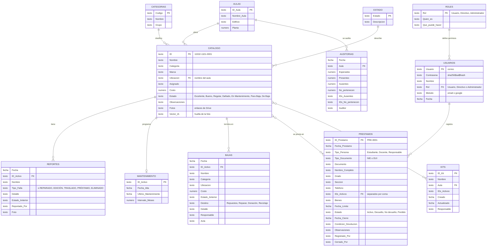

# SICAM · Sistema de Control de Activos y Mobiliario

Aplicación web para llevar el inventario de mobiliario y equipo del **Centro Escolar General Francisco Morazán** (código 11532). Cada bien tiene una etiqueta QR. Al escanearla con el teléfono se ve su ficha, se reporta una falla, se registra una reparación o se presta.

| | |
|---|---|
| **Proyecto** | EXPO 2026 CEFRAM · 2.º Técnico en Desarrollo de Software "A" · Módulo 2.8 |
| **Docente** | Elmer Antonio Sorto Hernández |
| **Equipo** | Matías Sebastián Serrano Henríquez · Allison Marlene Molina Luna · Sofía Abigail Ramos Gámez · Karen Elizabeth Martínez Monterrosa · Luis Fernando Álvarez Corpeño |
| **Tecnología** | Google Apps Script (servidor), Google Sheets (base de datos), HTML5, CSS3 y JavaScript (cliente) |
| **Costo** | $0. Solo usa servicios gratuitos de Google y librerías libres |

---

## 1. Qué hace

| Módulo | Para qué sirve |
|---|---|
| **Inicio** | Índice de salud del inventario, bienes por estado y categoría, presupuesto estimado de reparación, bienes que requieren atención y préstamos pendientes. |
| **Inventario** | Tabla con búsqueda y filtros (aula, estado, prestados). Permite ver la ficha, editar, eliminar y exportar a CSV, Excel o PDF. |
| **Mapa 2D** | Plano de los tres edificios por planta. El color de cada aula indica su salud; al tocarla se ven sus muebles. También tiene una vista de gráfica. |
| **Escanear QR** | Lee el QR con la cámara o con una foto. Tiene un modo de auditoría que compara lo que hay en un aula con lo registrado. |
| **Reportar falla** | Reporte rápido con tipos de daño sugeridos y una foto opcional. El bien pasa a "En Mantenimiento" y se avisa a los encargados. |
| **Préstamos** | Préstamo de bienes a estudiantes (NIE y grado) o a docentes y responsables (DUI). Registra la devolución, imprime el comprobante y el acta de pérdida o no devolución. |
| **Gestión** | Ciclo de vida, mantenimiento preventivo, bajas y donaciones con acta, kits de aula y avisos por correo o Telegram. |
| **Registrar bien** | Alta de un bien con hasta 5 fotos. Una IA en el navegador (TensorFlow.js) reconoce bienes parecidos y sugiere los datos. |
| **Etiquetas QR** | Genera e imprime las etiquetas QR por aula. |
| **Ficha** | Página pública que abre el QR. Muestra fotos, estado, si está prestado, el historial y botones para reportar o marcar reparado. |
| **Buscador (Ctrl + K)** | Busca cualquier bien, aula, préstamo o acción desde cualquier pantalla. Solo muestra las acciones que permite tu rol. |
| **Informe para Dirección** | Resumen de una página para imprimir o guardar en PDF: estado general, presupuesto, préstamos vencidos y aulas que necesitan atención. |
| **Usuarios y roles** | Pestaña de Gestión donde el administrador cambia el rol de cada cuenta. |

Otras funciones: modo claro y oscuro, diseño para teléfono con barra inferior, inicio de sesión con correo o con Google, y contraseñas cifradas (SHA-256 con sal).

### Roles y permisos

Hay tres vistas. Cada cuenta tiene su rol en la columna **D (Rol)** de la hoja *Usuarios*. Las cuentas nuevas empiezan como **Usuario**.

| Acción | Usuario | Directivo | Administrador |
|---|:-:|:-:|:-:|
| Ver Inicio, Inventario, Mapa 2D, fichas y Guía | ✓ | ✓ | ✓ |
| Escanear o consultar un QR | ✓ | ✓ | ✓ |
| Reportar una falla | ✓ | ✓ | ✓ |
| Auditar un aula | | ✓ | ✓ |
| Exportar (CSV, Excel, PDF) e imprimir el Informe para Dirección | | ✓ | ✓ |
| Ver préstamos e imprimir comprobantes y actas | | ✓ | ✓ |
| Ver Gestión y autorizar bajas o donaciones | | ✓ | ✓ |
| Registrar, editar y eliminar bienes | | | ✓ |
| Marcar como reparado e imprimir etiquetas QR | | | ✓ |
| Crear, cerrar y eliminar préstamos | | | ✓ |
| Mantenimiento, proponer bajas, kits y avisos | | | ✓ |
| Cambiar el rol de otras cuentas | | | ✓ |

- **Usuario**: docentes y estudiantes colaboradores.
- **Directivo**: Dirección y Subdirección.
- **Administrador**: el encargado del inventario.

**Cómo se protege.** Al iniciar sesión, el servidor entrega una llave secreta (token) que dura 30 días. El navegador la manda en cada acción, y el servidor busca el rol de esa persona en la hoja *Usuarios* antes de guardar nada (`server/Sesion.gs`, función `exigirRol_`). Ocultar botones solo ordena la pantalla; aunque alguien los active a la fuerza, el servidor responde "Esta acción solo la puede hacer un administrador". Si el administrador cambia un rol, se aplica al instante. Al cerrar sesión, la llave deja de servir.

### Paleta de colores y logo

La aplicación usa siempre la paleta azul de SICAM y el logo de las tres franjas. Los colores están en las variables de `css/Estilos` (sección 1).

| Uso | Color |
|---|---|
| Azul del logo y encabezados de la hoja | `#01265d` |
| Menú lateral | `#041f3a` |
| Botones principales | `#1b76bd` (al pasar el mouse: `#15588f`) |
| Acento (opción activa, botón Escanear) | `#4a91c9` |
| Mantenimiento y dados de baja | `#38668a` y `#48647a` |
| Texto | `#091e2f` y `#314252` |
| Fondo y bordes | `#eef3f8`, `#e6edf4` y `#c9d6e2` |
| Modo oscuro | `#00101d` (fondo) y `#091e2f` (tarjetas) |

La única excepción son los colores de estado: **verde** para Bueno, **naranja** para Regular y **rojo** para Dañado. Se dejaron así porque todo el mundo los entiende de inmediato.

El logo está dibujado en SVG dentro de `Iconos` (símbolo `logo-marca`), así que se ve nítido en cualquier tamaño y se adapta al modo oscuro. Aparece en el menú, en el inicio de sesión, en la ficha pública y en el encabezado de los informes y actas impresos.

---

## 2. Estructura de archivos

```
SICAM/
├── config/
│   └── Config.gs           Constantes: ID de la hoja, código del centro, caché, reglas de préstamos
├── server/                 Servidor (Google Apps Script)
│   ├── Main.gs             doGet (entrada web), include() y acceso a la hoja
│   ├── Utilidades.gs       Caché, fechas, búsqueda de filas, fotos en Drive
│   ├── Validacion.gs       Limpieza y validación de datos del lado del servidor
│   ├── Catalogo.gs         Códigos del Manual Escolar, IDs y CREAR activos
│   ├── Activos.gs          LEER, EDITAR y ELIMINAR activos; ficha de un bien
│   ├── Reportes.gs         Fallas, reparaciones y auditorías
│   ├── Aulas.gs            Edificios, plantas y mapa 2D
│   ├── Usuarios.gs         Registro, inicio de sesión y acceso con Google
│   ├── Sesion.gs           Llaves de sesión, roles y permisos; administración de usuarios
│   ├── BaseDeDatos.gs      prepararBaseDeDatos(): ordena y completa la hoja de cálculo
│   ├── Gestion.gs          Mantenimiento, bajas, kits, avisos e historial
│   └── Prestamos.gs        CRUD de préstamos
├── css/
│   ├── Estilos.html        Estilos de toda la aplicación (tokens de color, claro y oscuro)
│   └── Ficha.html          Estilos propios de la ficha pública
├── js/
│   ├── Tema.html           Aplica el tema guardado antes de pintar
│   ├── App.html            Núcleo: datos, utilidades, sesión, navegación, buscador y eventos
│   ├── Inicio.html         Panel de inicio
│   ├── Inventario.html     Tabla, vista rápida, edición, eliminación y exportación
│   ├── Registro.html       Registro con fotos e IA, y etiquetas QR
│   ├── Escaner.html        Lector QR, auditoría y reporte de fallas
│   ├── Mapa.html           Mapa 2D
│   ├── Gestion.html        Mantenimiento, bajas, kits, avisos y usuarios
│   ├── Prestamos.html      Préstamos, comprobante y actas
│   └── Ficha.html          Lógica de la ficha pública
├── Index.html              Estructura HTML5 de la aplicación
├── Ficha.html              Estructura HTML5 de la ficha pública
├── Iconos.html             Íconos SVG compartidos y el logo de SICAM
└── README.md
```

**Reglas de código que se cumplen:**
- Ningún archivo HTML tiene `style="…"` ni `onclick="…"`. Los botones usan atributos `data-accion`, `data-arg`, `data-abrir`, `data-fondo`, `data-cambio` y `data-enviar`. Un solo detector de eventos en `js/App` (sección 8) los atiende.
- Los anchos de las barras de las gráficas viajan en `data-w` y se aplican con JavaScript.
- Cada archivo empieza con un comentario que explica qué contiene y está dividido en secciones numeradas.
- Se usan etiquetas semánticas: `header`, `main`, `nav`, `aside`, `section`, `article`, `fieldset` y `dialog` (con `role` y `aria-*`).

---

## 3. Base de datos (Google Sheets)

Cada hoja de cálculo funciona como una tabla. El script **`prepararBaseDeDatos`** (`server/BaseDeDatos.gs`) deja la hoja lista en un solo paso:
1. Crea las hojas que falten con sus encabezados, que quedan en azul marino y fijos al bajar.
2. Borra las filas vacías que quedaron en medio de *Catalogo*, *Aulas*, *Reportes* y *Personal*.
3. Completa la hoja *Estado* con los 7 estados del ciclo de vida y crea la hoja *Roles*.
4. Cifra las contraseñas que estaban escritas en texto normal y unifica los roles (por ejemplo, "admin" pasa a "Administrador" y "Director" a "Directivo").
5. Agrega listas desplegables: Rol en *Usuarios*, y Estado y Ubicación en *Catalogo*. Así no se escriben valores con errores.
6. Corrige el nombre "Elmer Antonio Soto Hernadez" por "Elmer Antonio Sorto Hernández".
7. Quita las aulas 100 y 200, que no existen, y completa el edificio y la planta de las demás.

Se puede ejecutar varias veces sin riesgo: nunca borra filas con datos. Solo funciona desde el editor de Apps Script, no desde la página web.



También existen las hojas **Eliminados** (copia de cada bien eliminado, con fecha, quién y motivo) y **Personal** (lista de apoyo para los formularios).

**Almacenamiento seguro:**
- Cada escritura usa `LockService`, así que dos personas no pueden pisarse los datos al guardar al mismo tiempo.
- Eliminar un bien deja una copia en *Eliminados* y una línea en *Reportes*. Solo un administrador puede hacerlo.
- Los textos se limpian en el servidor antes de guardarse (`limpiarTexto_`). Si un texto empieza con `= + - @`, se le antepone `'` para que Sheets no lo ejecute como fórmula.
- Las contraseñas se guardan cifradas, nunca en texto plano.
- Cada acción que cambia datos revisa en el servidor la llave de sesión y el rol (ver *Roles y permisos*).

---

## 4. Validaciones

Cada dato se revisa **dos veces**: en el navegador, para avisar al instante debajo del campo, y en el servidor, porque es lo único que no se puede saltar.

| Dato | Regla | Mensaje si falla |
|---|---|---|
| NIE | Solo números, de 5 a 10 dígitos | "El NIE lleva solo números (de 5 a 10 dígitos)." |
| DUI | Formato `00000000-0` y dígito verificador correcto | "El dígito verificador no coincide. Revisa el DUI." |
| Nombre completo | Solo letras, al menos nombre y apellido | "Escribe nombre y apellido (solo letras)." |
| Grado | Obligatorio para estudiantes | "Elige el grado." |
| Sección | Una sola letra (se convierte a mayúscula) | "Una sola letra (A, B, C…)." |
| Teléfono | 8 dígitos que empiezan con 2, 6 o 7 (se escribe `7000-0000`) | "8 dígitos que empiecen con 2, 6 o 7." |
| Fecha de devolución | Desde hoy y hasta un año después | "No puede ser anterior a hoy." / "El préstamo no puede durar más de un año." |
| Bienes del préstamo | Al menos uno, no prestado ni dado de baja | "Agrega al menos un bien." |
| Nombre del bien | Mínimo 3 letras | "Escribe el nombre (mínimo 3 letras)." |
| Costo | Número entre 0 y 100 000 | "Debe ser un número entre 0 y 100 000." |
| Motivo de pérdida o eliminación | Mínimo 5 letras | "Describe qué pasó (mínimo 5 letras)…" |

Las acciones que no se pueden deshacer (eliminar un bien o un préstamo, cerrar un préstamo como perdido) piden confirmación. Toda acción termina con un mensaje claro de éxito o de error.

---

## 5. Instalación (paso a paso)

Antes de empezar, haz una copia del proyecto actual: en Apps Script, **Información general › Crear una copia**.

> **¿Ya tenías instalada la versión anterior (v5)?** No borres nada. Crea los 2 archivos nuevos, `server/Sesion` y `server/BaseDeDatos`, y reemplaza el contenido de todos los demás. Solo `server/Main`, `server/Utilidades`, `server/Validacion`, `js/Tema` y `js/Mapa` quedaron iguales. Luego sigue en el **Paso 4**.

### Paso 1. Borrar los archivos viejos
En el editor de Apps Script, borra estos archivos (clic en los tres puntos ⋮ › **Eliminar**):
- `Code.gs`
- `Script`
- `Estilos`
- `ficha` o `Ficha`

> ⚠️ Es obligatorio borrar `Code.gs`. Si se queda, sus funciones chocan con las nuevas y la aplicación falla.

### Paso 2. Crear los archivos nuevos
Presiona **＋** (Agregar un archivo). Elige **Secuencia de comandos** para los `.gs` y **HTML** para los demás. Escribe el nombre **exactamente como aparece en la tabla, con la barra `/`**. Apps Script los agrupa en carpetas solo. No escribas la extensión: el editor la agrega.

| # | Tipo | Nombre en Apps Script | Copiar el contenido de |
|---|---|---|---|
| 1 | Secuencia de comandos | `config/Config` | `config/Config.gs` |
| 2 | Secuencia de comandos | `server/Main` | `server/Main.gs` |
| 3 | Secuencia de comandos | `server/Utilidades` | `server/Utilidades.gs` |
| 4 | Secuencia de comandos | `server/Validacion` | `server/Validacion.gs` |
| 5 | Secuencia de comandos | `server/Catalogo` | `server/Catalogo.gs` |
| 6 | Secuencia de comandos | `server/Activos` | `server/Activos.gs` |
| 7 | Secuencia de comandos | `server/Reportes` | `server/Reportes.gs` |
| 8 | Secuencia de comandos | `server/Aulas` | `server/Aulas.gs` |
| 9 | Secuencia de comandos | `server/Usuarios` | `server/Usuarios.gs` |
| 10 | Secuencia de comandos | `server/Sesion` | `server/Sesion.gs` |
| 11 | Secuencia de comandos | `server/BaseDeDatos` | `server/BaseDeDatos.gs` |
| 12 | Secuencia de comandos | `server/Gestion` | `server/Gestion.gs` |
| 13 | Secuencia de comandos | `server/Prestamos` | `server/Prestamos.gs` |
| 14 | HTML | `Index` | `Index.html` |
| 15 | HTML | `Ficha` | `Ficha.html` |
| 16 | HTML | `Iconos` | `Iconos.html` |
| 17 | HTML | `css/Estilos` | `css/Estilos.html` |
| 18 | HTML | `css/Ficha` | `css/Ficha.html` |
| 19 | HTML | `js/Tema` | `js/Tema.html` |
| 20 | HTML | `js/App` | `js/App.html` |
| 21 | HTML | `js/Inicio` | `js/Inicio.html` |
| 22 | HTML | `js/Inventario` | `js/Inventario.html` |
| 23 | HTML | `js/Registro` | `js/Registro.html` |
| 24 | HTML | `js/Escaner` | `js/Escaner.html` |
| 25 | HTML | `js/Mapa` | `js/Mapa.html` |
| 26 | HTML | `js/Gestion` | `js/Gestion.html` |
| 27 | HTML | `js/Prestamos` | `js/Prestamos.html` |
| 28 | HTML | `js/Ficha` | `js/Ficha.html` |

Al crear un archivo, Apps Script le pone un contenido de ejemplo. Borra **todo** ese contenido antes de pegar.

Si por error creas un archivo sin la carpeta (por ejemplo `Estilos` en vez de `css/Estilos`), igual funciona: `include()` también lo busca por su nombre corto.

### Paso 3. Revisar la configuración
Abre `config/Config` y confirma que `SPREADSHEET_ID` sea el ID de tu hoja de cálculo. Es la parte de la dirección entre `/d/` y `/edit`.

### Paso 4. Preparar la base de datos
Arriba del editor, elige la función **`prepararBaseDeDatos`** y presiona **▶ Ejecutar**. La primera vez Google pide permiso: **Revisar permisos › tu cuenta › Configuración avanzada › Ir a SICAM › Permitir**. Al terminar, abre **Registro de ejecución** para ver qué cambió (hojas creadas, filas vacías borradas, contraseñas cifradas, etc.). Lo que hace está explicado en la sección 3.

### Paso 5. Publicar una versión nueva
**Implementar › Gestionar implementaciones › ✏️ (Editar) › Versión: Nueva versión › Implementar.**
Si no se crea una versión nueva, la dirección publicada sigue mostrando el código viejo. La dirección no cambia, así que las etiquetas QR ya impresas siguen funcionando.

### Paso 6. Asignar los roles
1. Inicia sesión en la aplicación con tu cuenta.
2. Si es la primera vez, en la hoja *Usuarios* escribe `Administrador` en la columna **D (Rol)** de tu cuenta. La lista desplegable ya trae las tres opciones.
3. Después, los demás roles se cambian desde la aplicación: **Gestión › Usuarios y roles**. Siempre debe quedar al menos un administrador.

> Como ahora el servidor usa llaves de sesión, todas las personas deben **volver a iniciar sesión una vez** después de publicar esta versión.
---

## 6. Guía de uso rápida

**Prestar un bien**
1. Abre **Préstamos › Nuevo préstamo**. También puedes prestar desde la vista rápida de un bien con el botón **Prestar**.
2. Elige quién lo recibe. **Estudiante** pide NIE y grado. **Docente** o **Responsable** pide DUI.
3. Escribe el nombre completo. La sección y el teléfono son opcionales.
4. Busca los bienes por nombre, ID o aula, o escanea su QR. Los bienes prestados o dados de baja no se pueden elegir.
5. Elige la fecha de devolución o usa los atajos *Hoy*, *1 semana* o *1 mes*.
6. Presiona **Registrar préstamo**. El sistema ofrece imprimir el **comprobante** para que la persona lo firme.

**Cerrar un préstamo**
- **Devolver**: indica cómo llegó (Bueno, Regular o Dañado). Si llegó dañado, el bien pasa a "Dañado".
- **Pérdida / no devuelto**: elige *No devuelto* o *Perdido* y describe lo que pasó. Se imprime el **acta** con espacios para las firmas de la persona, el responsable y la Dirección. Un bien perdido pasa a "Para Baja".
- Los préstamos vencidos aparecen en rojo, en Inicio y en el menú.

**Otras tareas:** registrar un bien, consultar con el QR, auditar un aula, reportar una falla, editar o eliminar un bien, y usar mantenimiento, bajas y kits. Están explicadas paso a paso dentro de la aplicación, en **Guía de uso**.

---

## 7. Pruebas realizadas

- El código del servidor se ejecutó completo en un simulador de Google Sheets: alta, edición, devolución, pérdida y eliminación de préstamos; validación de NIE y DUI; edición y eliminación de bienes; avisos, bajas y kits. Todas las respuestas llegaron sin objetos `Date`, que `google.script.run` no puede enviar.
- Se probó la interfaz en Chromium (escritorio de 1366 px y teléfono de 390 px, en modo claro y oscuro): todas las vistas, el flujo completo de préstamo con comprobante y acta, el buscador, el inicio de sesión y la ficha. **Cero errores en la consola** y ninguna página se desborda a lo ancho en el teléfono.
- Se probó cada rol por separado. El **usuario** solo ve sus 6 secciones. El **directivo** ve préstamos y gestión, pero no los botones de editar ni de prestar. El **administrador** ve todo. Además, al llamar al servidor a la fuerza con una cuenta sin permiso, la acción se rechaza. Una llave inventada o vencida devuelve al inicio de sesión, y cerrar sesión invalida la llave.
- `prepararBaseDeDatos` se ejecutó dos veces seguidas sobre una copia de prueba: la segunda vez no cambió nada, así que es seguro repetirla.

---

## 8. Cómo se cumple la rúbrica

| Criterio | Dónde se ve |
|---|---|
| 1. CRUD y almacenamiento | Activos: crear (`guardarActivoMaster`), leer (`obtenerListaActivos`), editar (`editarActivo`) y eliminar (`eliminarActivo`). Préstamos: `registrarPrestamo`, `obtenerPrestamos`, `editarPrestamo`, `cerrarPrestamo` y `eliminarPrestamo`. Escritura con candado, papelera *Eliminados* y caché. |
| 2. Funcionalidad sin errores | Cero errores en la consola en las pruebas. Eventos centralizados con delegación (`js/App`, sección 8); no hay `onclick` en el HTML. |
| 3. Código limpio y modular | Carpetas `/config`, `/server`, `/css` y `/js`. Un archivo por módulo, cada uno con un comentario de encabezado y secciones numeradas. Sin estilos ni scripts en línea. |
| 4. Diseño e interfaz | Diseño propio tipo *bento* con la paleta azul y el logo oficial de SICAM, colores por tokens, modo oscuro, una vista distinta por rol, barra inferior en el teléfono, tablas que se vuelven tarjetas, y modales que se abren desde abajo en el teléfono. |
| 5. Validación y seguridad | Validación doble (sección 4), limpieza contra fórmulas, contraseñas cifradas, llaves de sesión y roles revisados en el servidor en cada acción, y mensajes claros. |
| 6. Contenido y multimedia | Textos propios en español. Fotos reducidas a 960 px en JPEG antes de subirlas. Íconos SVG en un solo archivo (`Iconos`). |
| 7. Documentación | Este README: diagrama de la base de datos, instalación y guía de uso. |
| 9. Creatividad e innovación | IA en el navegador que reconoce bienes por foto, mapa 2D con salud por aula, préstamos con actas imprimibles, auditoría por QR, buscador global (Ctrl + K), proyección de presupuesto, tres vistas por rol e Informe para Dirección. |
| 10. Uso de recursos | 100 % gratis: Google Sheets, Apps Script, Drive y Gmail. Las librerías (TensorFlow.js, QR y Excel) se cargan solo cuando se necesitan. |
